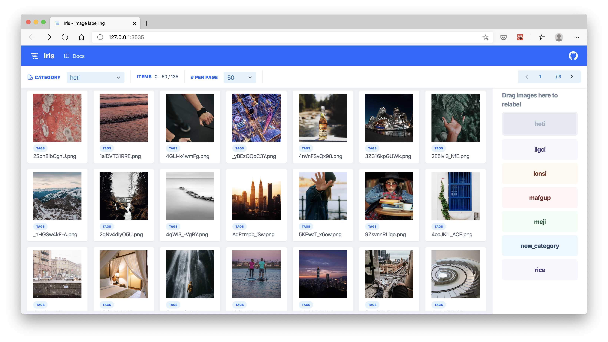

<p align="center">
  
  <h3 align="center">Iris - Data labelling</h3>
</p>

# Iris
> A browser based UI for labelling image files that tracks the labels using a database, rather than using folders and paths



## Why use Iris?
* Label thousands of images (or possibly millions?) easily without having to use a file manager that slows down.
  * Iris uses pagination to view subsets of your data, so the platform doesn't slow down with large quantities of images.
* Keep track of all your labels using a database.
  * Iris stores the labels for your data in an SQLite database file in a `.iris` directory that is created in the root of your data folder. This decouples labels from the directory paths, helping to avoid mistakes.
* Simple and easy to use drag and drop UI.
  * Images can be labelled using simple drag and drop interactions, making it easy for anyone to use.

## Installation
To install **iris**, first clone the Git repository and navigate into the project folder.

```shell
$   pip install .
```

## Usage
Once installed, **iris** registers as a command in your terminal that is accessible from any directory. 

**Iris** presumes your data is initially organised in a directory that has sub-directories for every category of your data **may** take on.

```
data/
    |---category_1/
        |---file_1.png
        |---file_2.png
    |---category_2/
        |---file_3.png
        |---file_4.png
```

The folders are initially used to deduce what categories your data can take on. They **do not** need to contain any data / images in them.

With the following project structure set up, navigate to the parent directory of `data/` and then launch **iris** as follows from the terminal:


```shell
$   iris launch -f data
```

The argument `-f` specifies the folder to look in for your images. An additional argument `-e` is used to specify the extension of images to look for. By default, it is set to `.png`.

**Iris** will launch on port 5000, from where you can go and begin labelling your data.

### Tags
Images can also take on tags, which are initially inferred based on the sub-directories. That is any directory below the top level directory. For example:

```
data/
    tag_1/
        another_tag/
            file_1.png
            file_2.png
            file_3.png
    tag_2/
        file_4.png
        file_5.png
        file_6.png
```

These tags show up in the browser based UI after hovering over the **Tag** label.

## To do
- [ ] Python API to access labels from database
- [ ] Ability to change tags using drag and drop interface
- [ ] Add new categories using browser UI
- [ ] Write unit tests for JS frontend
- [ ] Write unit tests for Python backend