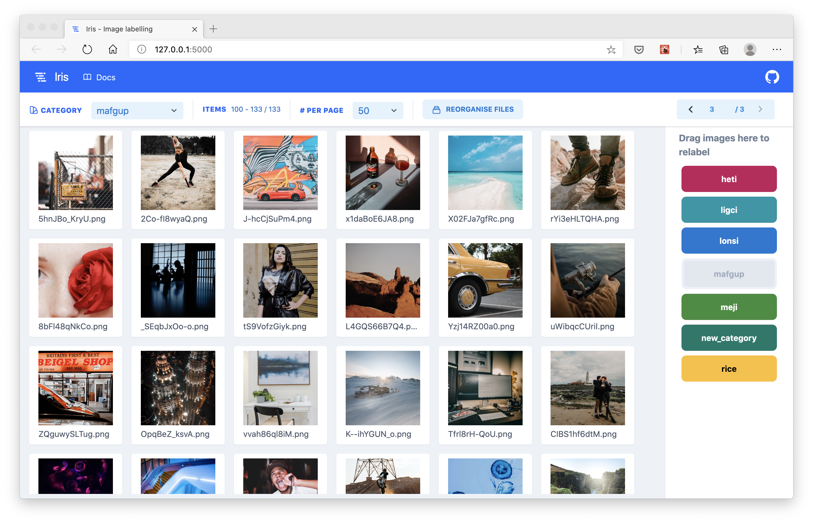

<p align="center">
  
  <h3 align="center">Iris - Data labelling</h3>
</p>

# Iris
> A browser based UI for labelling image files that tracks the labels using a database, rather than using folders and paths



## Why use Iris?
* Label thousands of images (or possibly millions?) easily without having to use a file manager that slows down with too many files.
  * Iris uses pagination to view subsets of your data, so the platform doesn't slow down with large quantities of images.
* Keep track of all your labels using a database.
  * Iris stores the labels for your data in an SQLite database file in a `.iris` directory that is created in the root of your data folder. This decouples labels from the directory paths, helping to avoid mistakes.
* Simple and easy to use drag and drop UI.
  * Images can be labelled using simple drag and drop interactions, making it easy for anyone to use.

## Installation
To install **iris**, first clone the Git repository and navigate into the project folder.

```shell
$   pip install .
```

## Usage
Once installed, **iris** registers as a command in your terminal that is accessible from any directory. 

**Iris** presumes your data is initially organised in a directory that has sub-directories for every category of your data **may** take on.

```
data/
    |---category_1/
        |---file_1.png
        |---file_2.png
    |---category_2/
        |---file_3.png
        |---file_4.png
```

The folders are initially used to deduce what categories your data can take on. They **do not** need to contain any data / images in them.

With the following project structure set up, navigate to the parent directory of `data/` and then launch **iris** as follows from the terminal:


```shell
$   iris launch -f data
```

**Iris** launches by default on port 5000, from where you can go on and begin labelling your data.

Argument | Description
--|--
-f | Folder to build database from
-h | The host to run the server on
-p | The port number to run the server on

### Reorganise data
To avoid any confusion between the re-labelled data, and the original categories inferred by the file paths of the images, a button labelled 'Reorganise data' is present in the toolbar.
This will re-organise the files amongst the folders according to the new labels.


### Tags
Images can also take on tags, which are initially inferred based on the sub-directories. That is any directory below the top level directory. For example:

```
data/
    tag_1/
        another_tag/
            file_1.png
            file_2.png
            file_3.png
    tag_2/
        file_4.png
        file_5.png
        file_6.png
```

These tags show up in the browser based UI after hovering over the **Tag** label.

### Programmatic API
Once **iris** has been launched inside a directory and the `.iris` folder has been
setup, you can use the Python API to get the labels and make any more changes
programmatically.

#### Getting the list of files
The complete list of files can be returned using the following snippet. The `folder` argument to the `Query` class is the relative path to the folder where your images are stored.

```python
from iris.api.files import Query

q = Query(folder="../images/")
df = q.get_all_files()
```

Example output:

id |	path |	filename |	category |	tags
--|--|--|--|--|
270 |	images/heti/clf/ignore/2Sph8IbCgnU.png |	2Sph8IbCgnU.png	|heti |	[clf, ignore]
271 |	images/heti/clf/ignore/1aiDVT31RRE.png |	1aiDVT31RRE.png	|heti |	[clf, ignore]
272 |	images/heti/clf/ignore/4GLI-k4wmFg.png |	4GLI-k4wmFg.png	|heti |	[clf, ignore]
273 |	images/heti/clf/ignore/-wuFyjSeLec.png |	-wuFyjSeLec.png	|meji |	[clf, ignore]

#### Modifying a file's attributes
You can modify any or all of the attributes of a file using the following snippet.

```python
from iris.api.files import Query

q = Query(folder="../images/")
q.update_file(270, {"category": "new_category"})
```

The second argument, `file_kwargs`, is a dictionary whose keys should correspond to one of the columns in the DataFrame. If the key provided does not exist, it will be ignored.

## To do
- [ ] Ability to change tags using drag and drop interface
- [ ] Add new categories using browser UI
- [ ] Write unit tests for JS frontend
- [ ] Write unit tests for Python backend